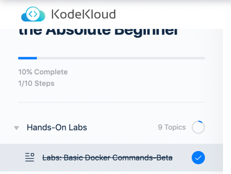

# 📆 2023-01-25 (WED)

## ☑️ 오늘 한 일 📑

- [x] 회사 업무 
- [x] docker 강의 듣기
- [ ] 구엔이일 읽기
- [x] 운동
- 
***

## 🔍️ 오늘 무엇을 했나요? Review

### 회사 업무
- 초대-> 회원가입 플로우에서 에러 발견
  - 해당 이슈 추적
    - 추적하면서 발견한 사항들 리스트업 
      - 내일 할게 많겠다..
- 신(?) 기능 회의 참석 
  - 새로운 도메인에 대한 설렘
  - 걱정 한스푼 

### docker
- docker 명령어 
  - `-it` : 자동 로그인 
  - `pull` : docker image를 다운받음
  - `run` : 로컬 환경에서 사용 가능한 docker image를 확인하고, image가 없으면 다운받고, 실행 
  - `rm` : ID나 이름을 적으면 docker container가 삭제됨 
    - 여러개를 동시에 삭제 가능. 
    - `docker rm 323 a13d dsf3`: `323`, `a13d`, `dsf3`에 해당하는 컨테이너가 삭제됨 
  - `rmi` : docker image 삭제
    - `rm`은 컨테이너를 삭제, `rmi`는 docker image를 삭제 
    - 삭제하려는 이미지가 특정 컨테이너에서 사용중이면 삭제 불가 
  - `exec`: 실행중인 컨테이너의 내부에서 명령을 실행하기 위해 

- 실습 1차 완료 

***

## 💡 오늘 회고

오늘은 사실 회사 업무를 뭘 해야할까? 고민을 하며 출근했다. 계획은 기존에 동료가 작업한 사항들과 앞으로 해야할 업무들을 파악하기로 세웠다.
오전 데일리 스크럼을 하고, 회의에 갑작스레 참석하였다. 새로운 기능(?)에 대한 첫 회의여서 가볍게 진행되었다. 

회의가 끝날 무렵, 회원가입 관련하여 이슈가 생겨서, 이슈를 추적하면서 찾아낸 여러 허점들을 리스트업했다. 
하루가 추적만 하다가 끝난 것 같지만, 이 상황을 통해 보완할 것들을 많이 찾고 생각해볼 수 있어서 좋았다. 

내일은 이슈 추적한 것들을 보완할 예정이고, 오후에는 머신러닝 세미나에 참석할 예정이다. 
되도록 이슈는 세미나 전에 끝내도록. 

docker 강의를 듣고 실습까지 해보니 확실히 머리에 잘 들어왔다. 내일도 들어야지! 

***

## 🎯 내일 할 일 🎯
- [ ] 회사 업무 
  - [ ] 이슈 추적으로 발견한 보완 리스트 처리
  - [ ] 머신러닝 세미나 참석
- [ ] docker 강의 듣기
- [ ] 구엔이일 스터디
- [ ] 운동

***

## 🏁 이번주 목표 🏁
- [ ] docker 강의 듣기 
- [ ] 리얼 마이에스큐엘 12, 13장 읽기
- [ ] 구엔이일 스터디
 