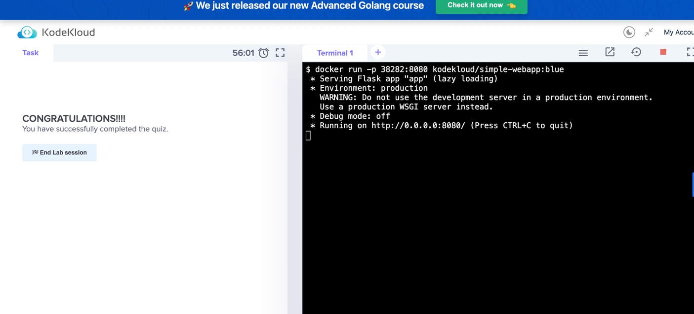
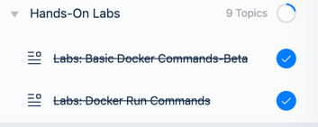

# 📆 2023-01-26 (THU)

## ☑️ 오늘 한 일 📑

- [x] 회사 업무 
  - [x] 이슈 추적으로 발견한 보완 리스트 처리
  - [x] 머신러닝 세미나 참석
- [x] docker 강의 듣기
- [x] 구엔이일 스터디
- [ ] 운동

***

## 🔍️ 오늘 무엇을 했나요? Review

### 회사 업무
- exception을 리팩토링
  - 메세지를 보다 친절하게 제공 (단서를 제공)
    - 지금 생각해보니 에러가 났을때, 프론트에서 에러메시지를 토스트로 보여주게 되어있는데, 가공을 해야하지 않을까...
- 퍼미션 리팩토링
  - 이름을 좀 더 행동에 초점을 맞춰 수정하였다. 
  - 내부 로직도 행동에 초점을 맞춰 책임을 분리할 필요가 있다. 
    - 다시 생각해보니, 필요없는 체크 부분도 있었다. 
    - 퍼미션 테스트부분에서 request query param이 없는...이슈...발생 
- 머신러닝 세미나
  - 오랜만에 대학시절 통계학 전공 수업을 듣는 거 같아 재밌었다. 
  - 머신러닝도 해보고 싶다는 생각이 강하게 들었다.
    - 어쩌면 적성에 맞을거 같다는 생각이 듬

### docker
- docker run할 때, 최신 버전이 아닌 다른 특정 버전을 쓰고 싶을 때, `:`으로 버전을 입력하면 되는데, 이를 테그라고 한다. 
  - ex: `docker run redis:4.0`
  - 입력하지 않으면 기본 테그는 `latest`가 되는데, `latest`는 해당 소프트웨어 작성자가 관리하는 최신 버전을 의미.
- docker는 기본적으로 비대화형으로 대화형으로 사용하려면 `-i`옵션이 필요하다. 
- `-t`는 가상 터미널 옵션이다. 
- `-it`: 대화형 + 가상 터미널 
- `p`: 포트 연결 
  - `docker run -p 80:5000 webapp ` : 80으로 접속하면 5000으로 라우트됨 
- `-v` : 볼륨 `docker run {외부 디렉터리}:{도커 컨테이너 내부 디렉터리} 이미지`
  - docker rm를 하면 그동안 쌓았던 데이터가 모두 날아가게됨
    - 따라서, 데이터를 보존하기위해 도커 호스트 컨테이너 외부 디렉터리를 컨테이너 내부 디렉터리에 매핑해야 함 
    - 도커 컨테이가 실행될 떄, 도커 컨테이너 내의 폴더로 외부 디렉터리가 내부적으로 마운트됨 
- `inspect`: 도커 ps는 도커 정보를 주는데, 특정 컨테이너의 세부 정보를 얻고싶을 때 쓰는 명령어 
  - 컨테이너의 모든 세부 정보를 JSON으로 제공 
- `logs`: 컨테이너 로그 

- 실습 2차 완료 
- 
- 

### 구엔이일 스터디 
- 자동화 경험 
  - 귀찮은건 자동화하자

***

## 💡 오늘 회고

오늘도 시간이 순식간에 사라졌다. 할 일들이 많아서 리스트 업을 해놓고 하나씩 지워갔다. 
간단한 작업들 먼저 끝내두고 미뤄왔던 작업을 하려고보니 코드적으로 어떻게 풀어가야할지 고민이 많아졌다. 
이런 저런 방법들을 생각하는 사이 머신러닝 세미나 시간이 되어 세미나를 들었다. 일단 세미나 자체의 대상자가 머신러닝을 아예 모르는 사람들을 대상으로 맞춰져있어서
설명이 잘 들렸다. 수학 전공 지식이 있어서 보다 쉽게 들렸다. 여튼 듣다가 고민하던 기능에 대한 방법들이 생각나서 정리를 했다. 
마지막에 확신이 서지 않아서 도움을 요청했다. 도움을 요청할 때, 컨텍스트를 전달하려다보니 본질을 이야기하기 전에 대화가 진행되서 원하는 부분에 대한 질문의 답을 얻기까지 시간이 걸렸다. 
하지만 그 사이에 찜찜한 부분들도 긁혀져서 좋았다. 반면에 이미 정립된 것들이 혼란이 오는 것들도 있었다. 작업이 좀 더 스케일이 커져서 내일 이어서 작업 할 예정이다. 
테스트 케이스를 짜는데 문제가 생겨서 내일도 순탄치는 않을 거 같다. 

도커 강의를 듣고 있는데, 이 강의가 나한테 잘맞는다. 바로 바로 실습할 수 있는 것도 좋고, 설명도 친절해서 좋다. (대상자 초보인게 나한테 잘 맞는거 같다.)

구엔이일 스터디가 다음주 서평을 마지막으로 끝난다. 다음 스터디가 기대된다. 리팩터링이라니, 실무에서 리팩터링을 언제하는지에 대한 궁금증이 생겼다. 
지금 현재 회사에서는 리팩터링을 해야겠어! 하고 있지않고, 코드리뷰도 하고 있지 않아서 각자 개인이 챙기지 않으면 리팩터링을 안하는데, 다른 곳에서는 어떤 식으로 하는지 궁금해졌다. 

이래저래 생각이 많았는데, 막상 쓰려고보니 생각이 안나서 여기서 마무리. 

***

## 🎯 내일 할 일 🎯
- [ ] 회사 업무 
  - [ ] 퍼미션 정책 정리
  - [ ] 필터 만들기 
- [ ] docker 강의 듣기
- [ ] 리얼 마이에스큐엘 12장 읽기
- [ ] 운동

***

## 🏁 이번주 목표 🏁
- [ ] docker 강의 듣기 
- [ ] 리얼 마이에스큐엘 12, 13장 읽기
- [x] 구엔이일 스터디
 