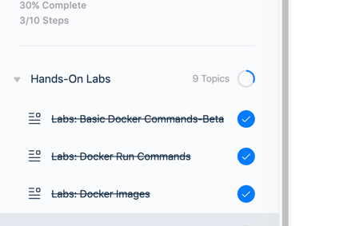
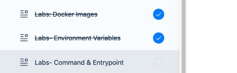
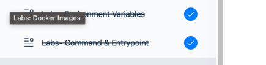

# 📆 2023-01-27 (FRI)

## ☑️ 오늘 한 일 📑
- [x] 회사 업무 
  - [x] 퍼미션 정책 정리
  - [x] 필터 만들기 
- [x] docker 강의 듣기
- [ ] 리얼 마이에스큐엘 12장 읽기
- [ ] 운동

***

## 🔍️ 오늘 무엇을 했나요? Review

### 회사 업무
- `exception`을 리팩토링했다. 
  - 메시지를 사용하는 쪽에서 보내도록 했던 것을, 필요한 정보를 파라미터로 넘겨서 생성자 안에서 만들도록 변경함 
- permission 정책 정리 
  - 사용자 관점에서 직접 상황을 연출해보며 경우의 수를 생각했다. 
    - 케이스를 나누고 보니, 필요없는 로직도 있어서 제거하였다. 
    - 책임이 확실해졌다. 
- 필터 만들기
  - 특정 조건의 사용자에게 아무것도 보여주지 않는 필터를 만들었다. 
  - `queryset.none()`이라는 것을 처음 써봄 
    - 이 쿼리 이후로 뒤에 체이닝 되는 것은 무시됨 
      - 반환 값이 `EmptyQuerySet`이어서 뒤에 체이닝되는 것은 의미가 없음 
      
### docker
#### docker image 만들기 
  - 만드는 이유? 
    - 애플리케이션에서 사용하려는 컴포넌트나 서비스를 도커 허브에서 찾을 수 없거나
    - 개발 중인 애플리케이션을 도커화해 배송과 배포가 쉽도록 하기 위해 
  - docker build : 이미지 만들기 
  - docker push : 이미지 도커 허브에 올리기 
  - 도커 파일은 도커가 인식하도록 특정한 형식으로 작성된 텍스트 
    - 명령어와 인수 형식
    - FROM : 컨테이너의 기본 운영체제 정의 
    - RUN: 도커가 기본 이미지에 특정 명령어를 실행하도 함 (의존성 설치 등)
    - COPY : 로컬 시스템의 파일을 복사해 도커 이미지에 넣음 
    - ENTRYPOINT : 이미지가 컨테이너로 실행될 때, 작동할 명령어를 지정 
  - 도커는 계층형 아키텍쳐로 이미지를 구축 
    - 명령어의 각 줄이 도커 이미지에 계층을 이룸. 이전 계층의 변경사항으로 
    - 모든 계층은 캐시되기 때문에 중간에 실패해도 docker build를 재실행하도록 계층형 아키텍처가 도움
    
- 실습 3차 완료 
- 

#### 도커 환경 변수 
  - 환경 변수를 설정하여, 도커로 환경변수를 전달할 수 있다. 
  - `-e` 옵션 사용
  - 이미 실행되고 있는 컨테이너의 환경변수가 궁금하다면, `inspect`명령을 사용하여 확인이 가능하다. 
    - `config: Env`에 있음
- 실습 4차 환경변수 완료
- 

#### Docker CMD 인수(argument) & 진입점(ENTRYPOINT)
- CMD : Dockerfile에서 시작할 때, 컨테이너 내에서 실행될 프로그램을 정의
  - 명령어를 입력할 수 있고, JSON 배열 형태로 입력할 수 있음
    - JSON 배열 형태로 입력하는 경우, 배열의 첫번째는 실행 파일이어야 함
    - command와 파라미터를 같이 쓰면 안됨
- ENTRYPOINT : 컨테이너가 시작될 때 실행할 프로그램을 지정 
  - 명령줄 매개변수가 추가된다. 
- 실습 5차 CMD & ENTRYPOINT 완료
- 

### 리얼 마이에스큐엘 12장 읽기  
전문검색 
- 용량이 큰 문서를 단어 수준으로 쪼개어 문서 검색을 하게 해줌
- 문서들의 단어를 분리해 형태소나 어원과 관계없이 특정 길이의 조각으로 인덱싱하는 n-gram 파서가 있다. 
  - 형태소를 분석하지 않는 다는 점에서 한글 문서 검색에 이용가치가 매우 높다. 
  - 공백과 같은 띄어쓰기 단위로 단어를 분리하고, 그 단어를 단순히 주어진 길이로 쪼개서 인덱싱하는 알고리즘
  - 쪼갤 길이 단위를 설정하는데, 설정 값에 따라 검색어의 길이 제약이 생김
    - 길이 단위보다 검색어의 길이가 작으면 찾지 못함

***

## 💡 오늘 회고

도커 이미지 부분은 좀 어려웠다. 헷갈렸다? 안 와닿았다? 도커 이미지가 어렵다기보다는 도커 파일을 작성해가는 과정이 어려웠던거 같다. 
작성 자체는 쉽지만, 애플리케이션 이미지를 띄우려면 어떤 것들이 필요한지 알고 수행하는 것이 어려운거 같다. 이것도 경험해보면 쉬운거였구나 알겠지. 
그래도 바로 실습을 진행해서 어떻게 하는지 감이 더 잡혔다. 

회사 업무를 하면서 대화를 어떻게 해야하는가에 고민이 생겼다. 대화는 나 혼자 하는 것이 아니고 상대가 있기 때문에, 더 어렵다. 
한단계 올라가면 다음 단계가 오는 것처럼 매번 다른 어려움이 있다. 스트레스가 압도되어 일이 손에 안잡히고 의욕이 떨어졌다. 
평소에 점찍어 두었던 창가쪽 테이블로 자리를 옮겼다. 마음을 다스리며 일에 집중하다보니 다시 차분히 일을 할 수 있었다. 
대화를 줄여야겠다는 생각이 많아졌다. 좋지 않은 방향인거 같은데, 지금은 내가 스트레스 받아서 예민해지지 않으려면 필요한 대화만 하자는 결론이 내려졌다. 
또 다른 좋은 방법을 찾을 때까지는 사려야지. 

리얼 마이에스큐엘 12장은 확장 검색으로, 생소한 영역이다. 앞 부분만 잠깐 읽었는데, 재밌다. 구글같은 큰 검색엔진이 있는 곳은 어떻게 처리했지? 더 궁금해졌다. 
엄청 복잡한 검색 알고리즘이 있을 터인데, 실제로 이 확장 검색을 이용해서 검색 기능을 구현하는 사례가 궁금하다. 
아직 실무에서 내가 직접 본거로는 `like`절이 다였다. 내가 모를수도....

***

## 🎯 내일 할 일 🎯
- [ ] docker 강의 듣기
- [ ] 리얼 마이에스큐엘 12장 읽기
- [ ] 운동

***

## 🏁 이번주 목표 🏁
- [ ] docker 강의 듣기 
- [ ] 리얼 마이에스큐엘 12, 13장 읽기
- [x] 구엔이일 스터디
 